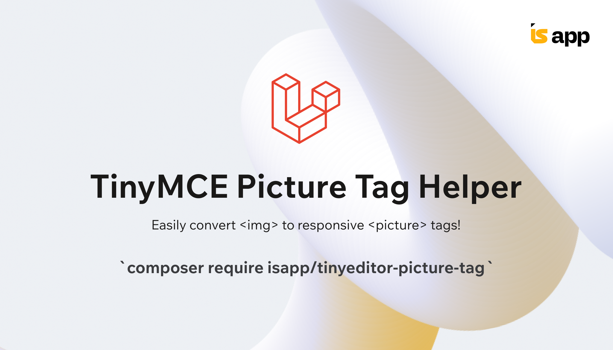

# TinyMCE Picture Tag Helper for Laravel

[](https://github.com/isap-ou/tinyeditor-picture-tag)

This helper is designed for Laravel projects and works through model observers triggered after a model is created or
updated.
It transforms the default `` tags inserted by TinyMCE into `<picture>` tags, enabling responsive images based on
your predefined configuration.

> **⚠️ Important:**  
> This helper works exclusively with [Spatie Media Library](https://spatie.be/docs/laravel-medialibrary).
> Make sure the library is installed and properly configured in your project before using this helper.

## How It Works

The helper listens for model creation or updates and processes any TinyMCE content by converting `` tags into
`<picture>` tags.
This transformation ensures that your images are responsive and optimized for various devices and browsers.

## Example: Transformation

Below is an example of how the helper transforms content.

### Before Transformation

When an image is inserted into TinyMCE, it looks like this:

```html

```

### After Transformation

After the helper processes the content, the result is:

```html

<picture>
    <source srcset="images/example.webp" type="image/webp">
    <source srcset="images/example.jpg" type="image/jpeg">
    
</picture>
```

## Installation

You can install the package via composer:

```bash
composer require isapp/tinyeditor-picture-tag
```

### Preparing your model

```php

namespace App\Models;

use Illuminate\Database\Eloquent\Model;
use Isapp\TinyeditorPictureTag\Concerns\InteractsWithTinyeditor;
use Isapp\TinyeditorPictureTag\Contracts\HasTinyeditorPictureTag;
use Spatie\MediaLibrary\HasMedia;
use Spatie\MediaLibrary\InteractsWithMedia;

class YourModel extends Model implements HasMedia, HasTinyeditorPictureTag
{
    use InteractsWithMedia;
    use InteractsWithTinyeditor
```

### Configuration: Setting Up TinyEditor Fields

To configure how TinyEditor content is processed and make images responsive, set up the following method in your model:

```php
public function registerTinyeditorFields(): void
{
    $this->registerTinyeditorField('<field_name>', '<collection_name>')
        ->registerSource(
            $this->registerTinyeditorPictureSource('<conversion_name>')
                ->setWidth(1200)
                ->setFormat('webp')
                ->setBreakpointMinWidth(576)
        )
        ->registerSource(
            $this->registerTinyeditorPictureSource('<conversion_name>')
                ->setWidth(1200)
                ->setBreakpointMinWidth(576)
        )
        ->registerSource(
            $this->registerTinyeditorPictureSource('<conversion_name>')
                ->setWidth(410)
                ->setFormat('webp')
        )
        ->registerSource(
            $this->registerTinyeditorPictureSource('<conversion_name>')
                ->setWidth(410)
        );
}
```

This method configures the content field to generate responsive `<picture>` tags with multiple image sources based on the specified breakpoints, widths, and formats.

## Documentation

The full documentation for this package is still in progress and will be added soon. Stay tuned for updates!

## Contribution

This package was originally created to work seamlessly with [Filament](https://filamentphp.com/) and
the [Filament Forms TinyEditor](https://github.com/mohamedsabil83/filament-forms-tinyeditor/).

Contributions are welcome! If you have suggestions for improvements, new features, or find any issues, feel free to
submit a pull request or open an issue in this repository.

Thank you for helping make this package better for the community!

## License

This project is open-sourced software licensed under the [MIT License](https://opensource.org/licenses/MIT).

You are free to use, modify, and distribute it in your projects, as long as you comply with the terms of the license.